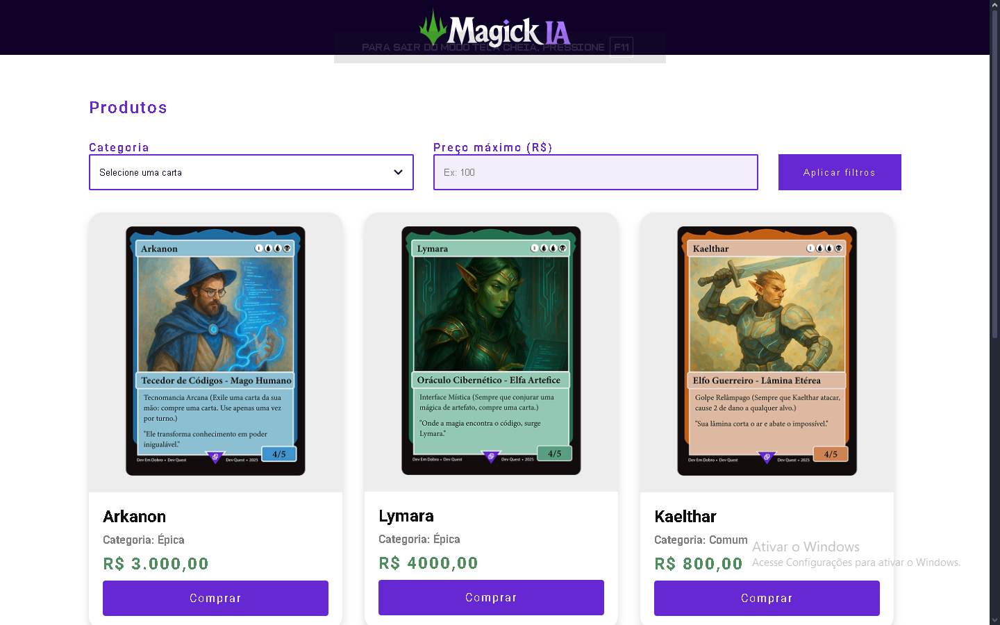

# 🧙‍♂️ Magick IA - Loja de Cartas Mágicas



Projeto de loja virtual fictícia para a venda de cartas mágicas, com design inspirado em jogos de RPG e TCGs (Trading Card Games), como **Magic: The Gathering**.

Você pode acessar o projeto online [clicando aqui](https://guil2x.github.io/magick-ia-szpc/).

---

## ✨ Funcionalidades

✅ Exibição de cartas mágicas com arte personalizada  
✅ Filtros por categoria de carta  
✅ Filtros por preço máximo  
✅ Sistema dinâmico de exibição (mostrar / esconder cartas)  
✅ Design responsivo e moderno  

---

## 🛠️ Tecnologias Utilizadas
<div style="display: inline_block"><br>
  
  
  
</div>

---

## 🚀 Como utilizar o projeto

1. Clone o repositório:

```bash
git clone https://github.com/Guil2x/magick-ia-szpc.git
